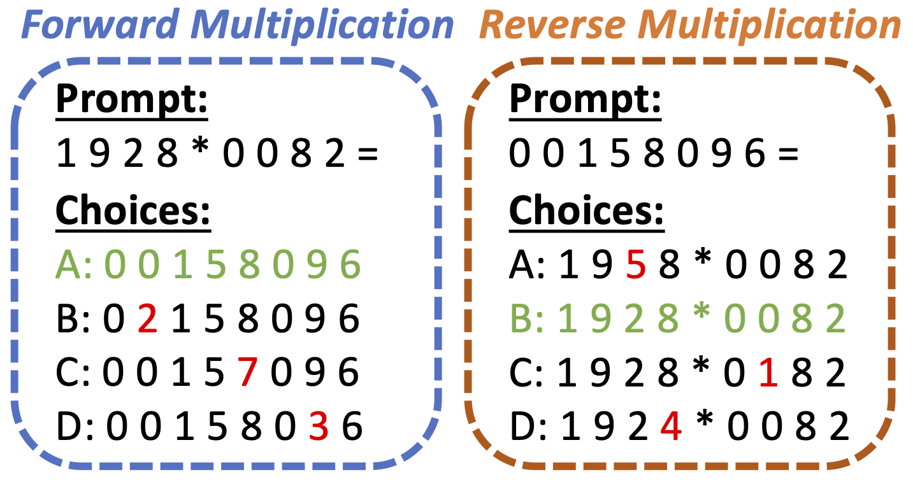

<div align="center">
  <h1>What Makes the Preferred Thinking Direction for LLMs in Multiple-choice Questions?</h1>

  [](https://arxiv.org/abs/2502.18435)
  [](https://machinelearning.apple.com)
  [](https://huggingface.co/apple/ml-reversal-blessing)
</div>

This software project accompanies the research paper, [What Makes the Preferred Thinking Direction for LLMs in Multiple-choice Questions?](https://arxiv.org/abs/2502.18435).

<div align="center">
  
</div>

## 🌟 Highlights

### 💡 Key Concept
Our paper demonstrates that right-to-left (R2L) factorization can outperform traditional left-to-right (L2R) approaches in specific MCQ reasoning tasks. We evaluate answer choices based on their likelihood of generating the question.

<div align="center">
  
</div>

### 🔍 Key Findings
- **Theoretical Insights**: We explore three key factors: calibration, computability, and conditional entropy
- **Empirical Evidence**: Lower conditional entropy correlates with higher task accuracy in both L2R and R2L models
- **Consistent Performance**: R2L models outperform L2R models across various MCQ benchmarks

### 🤗 Model Availability
The model checkpoints are available on [HuggingFace Hub](https://huggingface.co/apple/ml-reversal-blessing)
## 📊 Results
<div align="center">
  
</div>

<div align="center">


### Comparing L2R and R2L on MCQs

| | **DCLM-2B** |||  **EDU-2B** ||| **EDU-8B** ||| **HF-2B** |
|:--|:--:|:--:|:--:|:--:|:--:|:--:|:--:|:--:|:--:|:--:|
| | **L2R** | **R2L** | **% Change** | **L2R** | **R2L** | **% Change** | **L2R** | **R2L** | **% Change** | **L2R** |
| **Training loss** | **2.668** | 2.724 | +2.10 | **2.345** | 2.396 | +2.17 | **2.087** | 2.138 | +2.44 | - |
| **LogiQA** | 30.57 | **31.64** | +3.52 | 27.96 | **31.49** | +12.64 | 29.95 | **31.03** | +3.61 | - |
| **OpenbookQA** | 36.00 | **38.40** | +6.67 | 42.40 | **44.40** | +4.72 | 45.00 | **48.40** | +7.56 | 41.04 |
| **TruthfulQA** | 19.82 | **29.99** | +51.23 | 24.36 | **28.76** | +18.09 | 24.97 | **31.70** | +26.95 | - |
| **CommonsenseQA** | 42.83 | **45.29** | +5.74 | 42.92 | **45.13** | +5.15 | 39.15 | **44.96** | +14.84 | 36.60 |
| **Social IQA** | **41.56** | 40.94 | -1.48 | **42.78** | 42.22 | -1.32 | **44.58** | 43.50 | -2.42 | 40.52 |
| **ARC** | **54.11** | 43.88 | -18.91 | **60.65** | 52.31 | -13.75 | **68.29** | 56.22 | -17.67 | 57.47 |
| **HellaSwag** | **60.87** | 45.89 | -24.62 | **60.57** | 42.22 | -26.78 | **71.60** | 49.22 | -31.26 | 59.34 |
| **MathQA** | **26.50** | 22.21 | -16.18 | **26.80** | 24.86 | -7.25 | **28.77** | 25.33 | -11.96 | - |
| **MMLU** | **31.66** | 31.31 | -1.10 | **34.57** | 34.35 | -0.62 | **38.90** | 37.11 | -4.60 | 37.35 |
| **PIQA** | **74.43** | 58.05 | -22.00 | **74.48** | 57.13 | -23.30 | **77.80** | 59.14 | -23.98 | 76.70 |
| **Winogrande** | **61.01** | 53.51 | -12.29 | **60.93** | 54.85 | -9.97 | **65.75** | 54.70 | -16.81 | 57.54 |

</div>

*Note: All models are trained on 350B non-repeating tokens. The HF-2B baseline is from Penedo et al. (2024). EDU-2B, EDU-8B and HF-2B models are trained with the same FineWeb-EDU 350B dataset. Positive % Change values (indicating R2L wins) shown for LogiQA, OpenbookQA, TruthfulQA, and CommonsenseQA. Negative % Change values (indicating R2L loses) shown for other benchmarks.*

<div align="center">

### Results of the Controlled Simulation Study of 4-Digits Multiplication

| | **Forward X** || | **Reverse X** || |
|:--|:--:|:--:|:--:|:--:|:--:|:--:|
| | **L2R** | **R2L(m,n)** | **R2L(m)** | **R2L** | **L2R(m,n)** | **L2R(n)** |
| **Test Accuracy (%)** | **99.81±0.15** | 59.71±1.99 | 60.93±0.88 | **100±0** | 97.82±0.35 | 99.85±0.10 |
| **Train Accuracy (%)** | **99.76±0.15** | 59.03±1.66 | 61.22±1.12 | **100±0** | 97.90±0.42 | 99.98±0.04 |
| **Test Cond. Ent. (nats)** | 0.06 | 1.18 | 0.08 | 0 | 0.84 | 0.01 |
| **Train Cond. Ent. (nats)** | 0.06 | 1.17 | 0.08 | 0 | 0.83 | 0.01 |
| **Theo. Cond. Ent. (nats)** | 0 | 1.49 | 0 | 0 | 1.49 | 0 |
| **Training loss** | **0.86** | 0.94 | 0.94 | **0.86** | 0.94 | 0.94 |

</div>

*Note: Theoretical Conditional Entropy (Theo. Cond. Ent.) represents the expected conditional entropy under an ideal model. L2R consistently outperforms R2L in Forward X, while R2L is superior in Reverse X. Lower conditional entropy correlates with higher accuracy.*

## 🚀 Getting Started

### 1. Installation
```bash
pip install -r requirement.txt
```

### 2. Prepare Checkpoints
```bash
python simulation/download_model.py
```

### 3. Run the Model
```bash
# First add your HuggingFace API key
export HF_TOKEN=your_huggingface_token
bash simulation/run.sh multiplication l2r
```

## 📚 Citation

If you find this work useful, please cite our paper:

```bibtex
@article{zhang2025reversal,
  title={What Makes the Preferred Thinking Direction for LLMs in Multiple-choice Questions?},
  author={Zhang, Yizhe and Bai, Richard and Gu, Zijin and Zhang, Ruixiang and Gu, Jiatao and Abbe, Emmanuel and Bengio, Samy and Jaitly, Navdeep},
  journal={arXiv preprint arXiv:2502.18435},
  year={2025},
  url={https://arxiv.org/abs/2502.18435}
}
```
